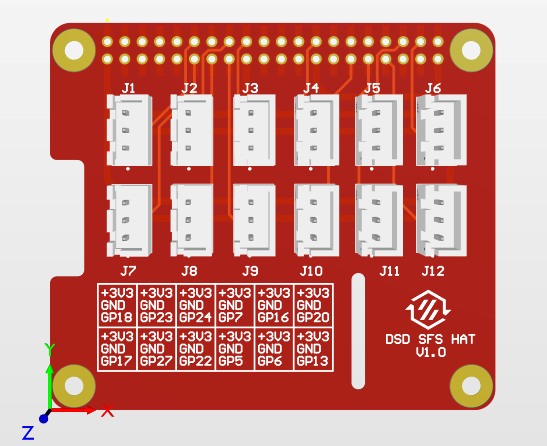

# BigTreeTech Smart Filament Sensor Pi HAT #

This is a Raspberry Pi HAT to connect up to 6 BigTreeTech SFS 2.0 modules directly to your Raspberry Pi if you've run out of spare GPIO pins on your main controller board. Specifically designed for use on Stealthchanger, it can also be used for up to 12 general purpose sensors, relays, switches or endstops.

Each header has pinouts for 3.3V, GND and GPIO to be used any way you see fit,and there's a handy silkscreen relating to the pinout of all 12 headers.



## BOM ##

I've designed this board so that you can choose between SMT or through-hole for the 40-pin GPIO header. The SMT headers listed below allow for pin passthrough when using this board in conjunction with other HATs or extra-tall stacking headers. 

| Item                       | QTY | Part Number        | Link (Non-Affiliate)        |
| -------------------------- | --- | ------------------ | --------------------------- |
| PCB                        | 1   | (See Gerber files) | [PCBWay](http://pcbway.com) |
| JST header                 | 12  | B3B-XH-A(LF)(SN)   | [Mouser](https://mou.sr/3PK9xdV) / [DigiKey](https://www.digikey.com.au/short/c4twnvc3) |
| GPIO header (SMT - tall)   | 1   | NPPC202KFMS-RC     | [Digikey](https://www.digikey.com.au/short/tp5nb95q) |
| GPIO header (SMT - short)  | 1   | Adafruit 2187      | [Adafruit 2187](https://www.adafruit.com/product/2187) |
| GPIO header (Through-hole) | 1   | Adafruit 2223      | [Adafruit 2223](https://www.adafruit.com/product/2223) |

The above GPIO header is an SMD header by Adafruit that allows for passthrough when using stacking headers for multiple HATs or access to all of the GPIO pins. Alternatively you can use a generic through-hole 40-pin header like [this one from Adafruit](https://www.adafruit.com/product/2223).

## Klipper Config - Generic Setup ##

To set up your Raspberry Pi as a secondary MCU, follow the official Klipper instructions [here](https://www.digikey.com.au/short/c4twnvc3).

In your printer.cfg, make sure you have your Pi entered as an MCU:

```
[mcu host]
serial: /tmp/klipper_host_mcu
```

Then you'll be able to call a GPIO pin using the following:

`pin: host:gpio18`

This should work for any instance where you may want to use a GPIO pin (endstops etc), EXCEPT for whenusing a filament sensor which calls `switch_pin:` instead of `pin:` as seen in the BTT example below.

## Klipper Config - BTT Smart Filament Sensor ##

If using this board for the BigTreeTech Smart Filament Sensor, below is the example config from the BigTreeTech SFS manual. Please use this only as an example of how to call the gpio pins:

```
[filament_switch_sensor switch_sensor]
switch_pin: host:gpio18
pause_on_runout: False
runout_gcode:
  PAUSE # [pause_resume] is required in printer.cfg
  M117 Filament switch runout
insert_gcode:
  M117 Filament switch inserted

[filament_motion_sensor encoder_sensor]
switch_pin: host:gpio17
detection_length: 2.88
extruder: extruder
pause_on_runout: False
runout_gcode:
  PAUSE # [pause_resume] is required in printer.cfg
  M117 Filament encoder runout
insert_gcode:
  M117 Filament encoder inserted
```

## Board GPIO Pinout ##

Below is the pinout for the SFS HAT board. Each JST header has pinouts for [ GPIO | GND | +3.3V ]. 

| Header | GPIO Pin |
| ------ | -------- |
| J1     | GPIO18   |
| J2     | GPIO23   |
| J3     | GPIO24   |
| J4     | GPIO7    |
| J5     | GPIO16   |
| J6     | GPIO20   |
| J7     | GPIO17   |
| J8     | GPIO27   |
| J9     | GPIO22   |
| J10    | GPIO5    |
| J11    | GPIO6    |
| J12    | GPIO13   |

## Manufacturing ##

I chose to get these boards made by PCBWay, but that's personal preference. It doesn't need any advanced techniques, so a simple 2-layer 1.6mm board with 1oz copper will suffice.

## Credits ##

Credit goes to the hard work by the people at DraftShift Design for their work on the Stealthchanger Voron toolchanger project, and BigTreeTech for the SFS and all they do for the open-source community.

[DraftShift Design](https://github.com/DraftShift)

[BigTreeTech](http://bigtree-tech.com)